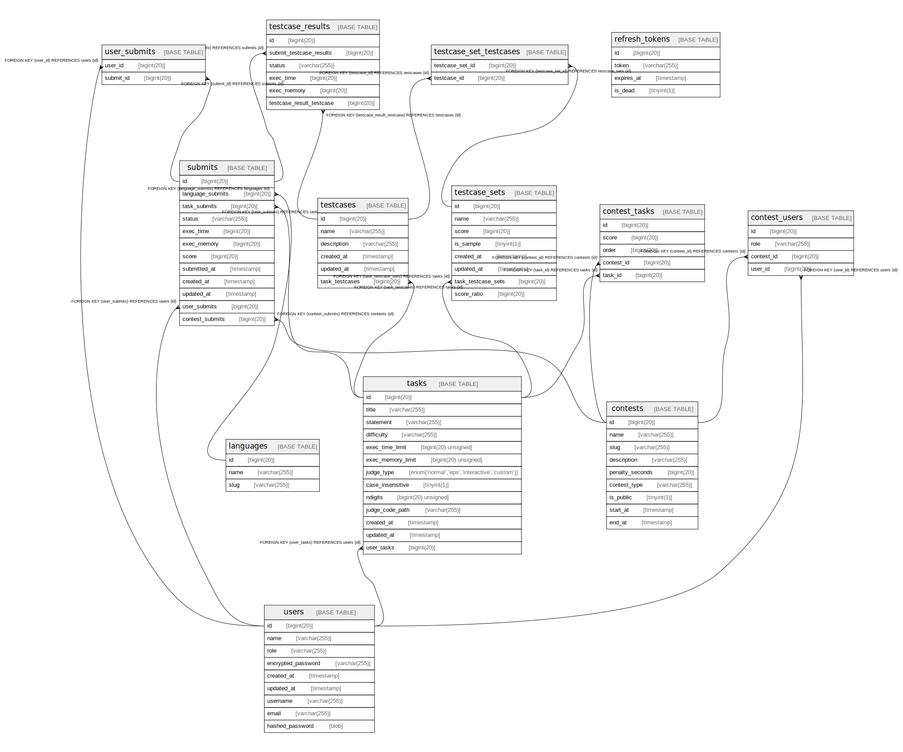

# szpp_judge_db

## Tables

| Name | Columns | Comment | Type |
| ---- | ------- | ------- | ---- |
| [contests](contests.md) | 9 |  | BASE TABLE |
| [contest_tasks](contest_tasks.md) | 5 |  | BASE TABLE |
| [contest_users](contest_users.md) | 4 |  | BASE TABLE |
| [languages](languages.md) | 3 |  | BASE TABLE |
| [refresh_tokens](refresh_tokens.md) | 4 |  | BASE TABLE |
| [submits](submits.md) | 12 |  | BASE TABLE |
| [tasks](tasks.md) | 13 |  | BASE TABLE |
| [testcases](testcases.md) | 6 |  | BASE TABLE |
| [testcase_results](testcase_results.md) | 6 |  | BASE TABLE |
| [testcase_sets](testcase_sets.md) | 8 |  | BASE TABLE |
| [testcase_set_testcases](testcase_set_testcases.md) | 2 |  | BASE TABLE |
| [users](users.md) | 9 |  | BASE TABLE |
| [user_submits](user_submits.md) | 2 |  | BASE TABLE |

## Relations

---

> Generated by [tbls](https://github.com/k1LoW/tbls)
