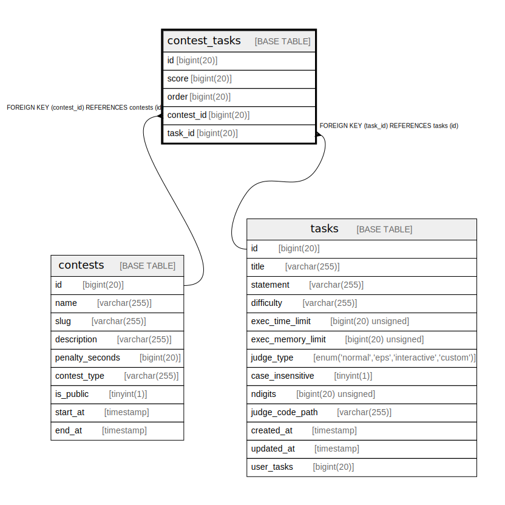

# contest_tasks

## Description

<details>
<summary><strong>Table Definition</strong></summary>

```sql
CREATE TABLE `contest_tasks` (
  `id` bigint(20) NOT NULL AUTO_INCREMENT,
  `score` bigint(20) NOT NULL,
  `order` bigint(20) NOT NULL,
  `contest_id` bigint(20) NOT NULL,
  `task_id` bigint(20) NOT NULL,
  PRIMARY KEY (`id`),
  UNIQUE KEY `contesttask_contest_id_task_id` (`contest_id`,`task_id`),
  KEY `contest_tasks_tasks_task` (`task_id`),
  CONSTRAINT `contest_tasks_contests_contest` FOREIGN KEY (`contest_id`) REFERENCES `contests` (`id`) ON DELETE NO ACTION,
  CONSTRAINT `contest_tasks_tasks_task` FOREIGN KEY (`task_id`) REFERENCES `tasks` (`id`) ON DELETE NO ACTION
) ENGINE=InnoDB DEFAULT CHARSET=utf8mb4 COLLATE=utf8mb4_bin
```

</details>

## Columns

| Name | Type | Default | Nullable | Extra Definition | Children | Parents | Comment |
| ---- | ---- | ------- | -------- | ---------------- | -------- | ------- | ------- |
| id | bigint(20) |  | false | auto_increment |  |  |  |
| score | bigint(20) |  | false |  |  |  |  |
| order | bigint(20) |  | false |  |  |  |  |
| contest_id | bigint(20) |  | false |  |  | [contests](contests.md) |  |
| task_id | bigint(20) |  | false |  |  | [tasks](tasks.md) |  |

## Constraints

| Name | Type | Definition |
| ---- | ---- | ---------- |
| contesttask_contest_id_task_id | UNIQUE | UNIQUE KEY contesttask_contest_id_task_id (contest_id, task_id) |
| contest_tasks_contests_contest | FOREIGN KEY | FOREIGN KEY (contest_id) REFERENCES contests (id) |
| contest_tasks_tasks_task | FOREIGN KEY | FOREIGN KEY (task_id) REFERENCES tasks (id) |
| PRIMARY | PRIMARY KEY | PRIMARY KEY (id) |

## Indexes

| Name | Definition |
| ---- | ---------- |
| contest_tasks_tasks_task | KEY contest_tasks_tasks_task (task_id) USING BTREE |
| PRIMARY | PRIMARY KEY (id) USING BTREE |
| contesttask_contest_id_task_id | UNIQUE KEY contesttask_contest_id_task_id (contest_id, task_id) USING BTREE |

## Relations



---

> Generated by [tbls](https://github.com/k1LoW/tbls)
