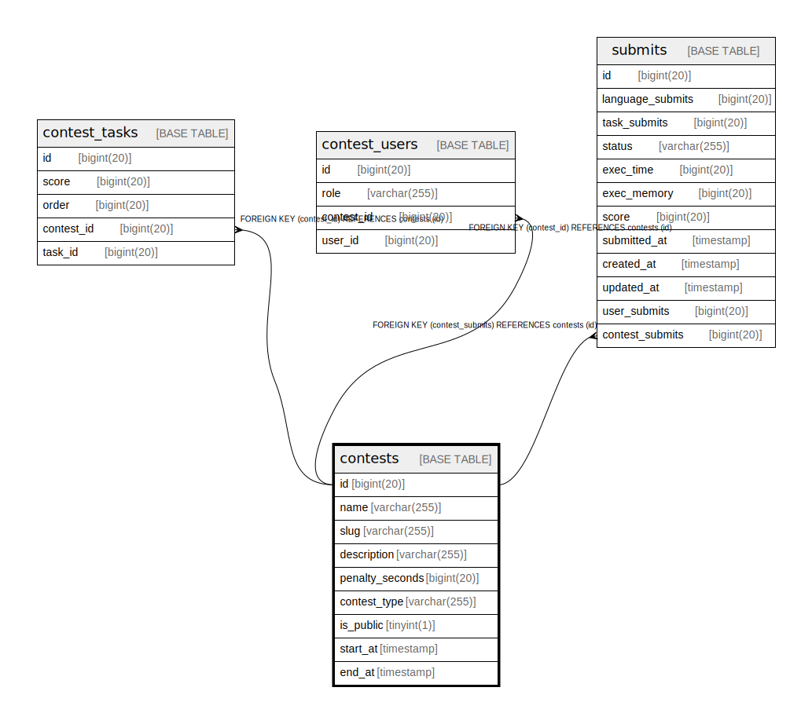

# contests

## Description

<details>
<summary><strong>Table Definition</strong></summary>

```sql
CREATE TABLE `contests` (
  `id` bigint(20) NOT NULL AUTO_INCREMENT,
  `name` varchar(255) NOT NULL,
  `slug` varchar(255) NOT NULL,
  `description` varchar(255) NOT NULL,
  `penalty_seconds` bigint(20) NOT NULL,
  `contest_type` varchar(255) NOT NULL,
  `is_public` tinyint(1) NOT NULL,
  `start_at` timestamp NULL DEFAULT NULL,
  `end_at` timestamp NULL DEFAULT NULL,
  PRIMARY KEY (`id`),
  UNIQUE KEY `slug` (`slug`)
) ENGINE=InnoDB AUTO_INCREMENT=[Redacted by tbls] DEFAULT CHARSET=utf8mb4 COLLATE=utf8mb4_bin
```

</details>

## Columns

| Name | Type | Default | Nullable | Extra Definition | Children | Parents | Comment |
| ---- | ---- | ------- | -------- | ---------------- | -------- | ------- | ------- |
| id | bigint(20) |  | false | auto_increment | [contest_tasks](contest_tasks.md) [contest_users](contest_users.md) [submits](submits.md) |  |  |
| name | varchar(255) |  | false |  |  |  |  |
| slug | varchar(255) |  | false |  |  |  |  |
| description | varchar(255) |  | false |  |  |  |  |
| penalty_seconds | bigint(20) |  | false |  |  |  |  |
| contest_type | varchar(255) |  | false |  |  |  |  |
| is_public | tinyint(1) |  | false |  |  |  |  |
| start_at | timestamp | NULL | true |  |  |  |  |
| end_at | timestamp | NULL | true |  |  |  |  |

## Constraints

| Name | Type | Definition |
| ---- | ---- | ---------- |
| PRIMARY | PRIMARY KEY | PRIMARY KEY (id) |
| slug | UNIQUE | UNIQUE KEY slug (slug) |

## Indexes

| Name | Definition |
| ---- | ---------- |
| PRIMARY | PRIMARY KEY (id) USING BTREE |
| slug | UNIQUE KEY slug (slug) USING BTREE |

## Relations



---

> Generated by [tbls](https://github.com/k1LoW/tbls)
