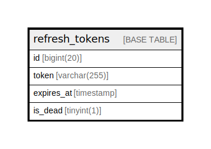

# refresh_tokens

## Description

<details>
<summary><strong>Table Definition</strong></summary>

```sql
CREATE TABLE `refresh_tokens` (
  `id` bigint(20) NOT NULL AUTO_INCREMENT,
  `token` varchar(255) NOT NULL,
  `expires_at` timestamp NULL DEFAULT NULL,
  `is_dead` tinyint(1) NOT NULL,
  PRIMARY KEY (`id`),
  UNIQUE KEY `token` (`token`)
) ENGINE=InnoDB DEFAULT CHARSET=utf8mb4 COLLATE=utf8mb4_bin
```

</details>

## Columns

| Name | Type | Default | Nullable | Extra Definition | Children | Parents | Comment |
| ---- | ---- | ------- | -------- | ---------------- | -------- | ------- | ------- |
| id | bigint(20) |  | false | auto_increment |  |  |  |
| token | varchar(255) |  | false |  |  |  |  |
| expires_at | timestamp | NULL | true |  |  |  |  |
| is_dead | tinyint(1) |  | false |  |  |  |  |

## Constraints

| Name | Type | Definition |
| ---- | ---- | ---------- |
| PRIMARY | PRIMARY KEY | PRIMARY KEY (id) |
| token | UNIQUE | UNIQUE KEY token (token) |

## Indexes

| Name | Definition |
| ---- | ---------- |
| PRIMARY | PRIMARY KEY (id) USING BTREE |
| token | UNIQUE KEY token (token) USING BTREE |

## Relations



---

> Generated by [tbls](https://github.com/k1LoW/tbls)
