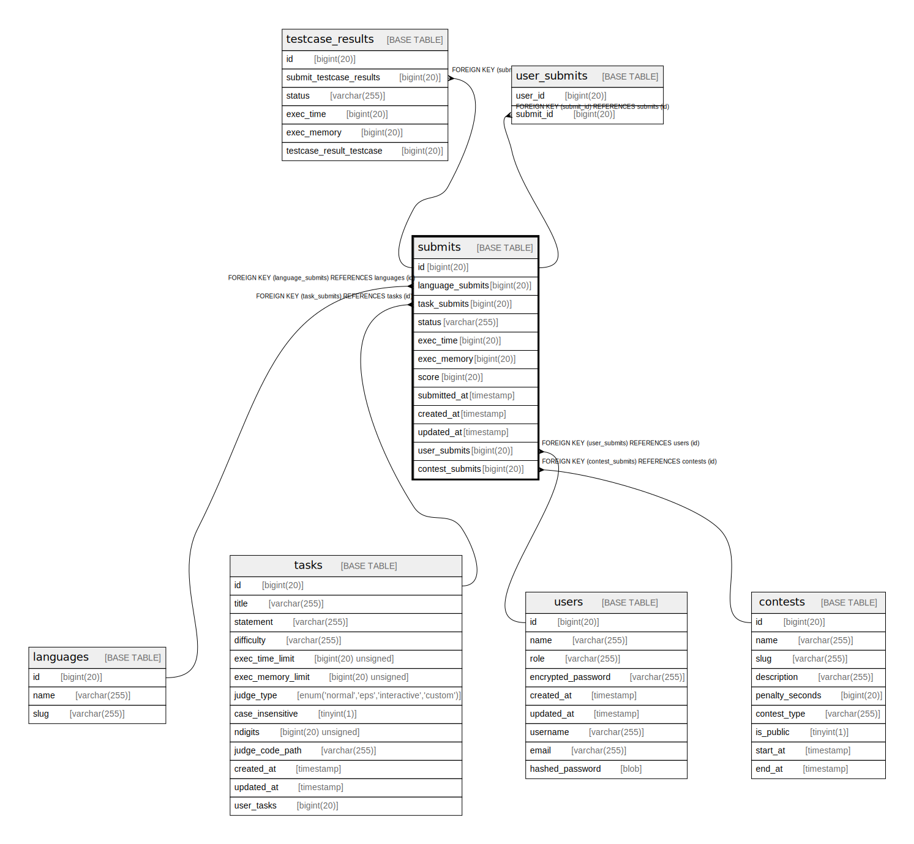

# submits

## Description

<details>
<summary><strong>Table Definition</strong></summary>

```sql
CREATE TABLE `submits` (
  `id` bigint(20) NOT NULL AUTO_INCREMENT,
  `language_submits` bigint(20) DEFAULT NULL,
  `task_submits` bigint(20) DEFAULT NULL,
  PRIMARY KEY (`id`),
  KEY `submits_languages_submits` (`language_submits`),
  KEY `submits_tasks_submits` (`task_submits`),
  CONSTRAINT `submits_languages_submits` FOREIGN KEY (`language_submits`) REFERENCES `languages` (`id`) ON DELETE SET NULL,
  CONSTRAINT `submits_tasks_submits` FOREIGN KEY (`task_submits`) REFERENCES `tasks` (`id`) ON DELETE SET NULL
) ENGINE=InnoDB DEFAULT CHARSET=utf8mb4 COLLATE=utf8mb4_bin
```

</details>

## Columns

| Name | Type | Default | Nullable | Extra Definition | Children | Parents | Comment |
| ---- | ---- | ------- | -------- | ---------------- | -------- | ------- | ------- |
| id | bigint(20) |  | false | auto_increment | [testcase_results](testcase_results.md) [user_submits](user_submits.md) |  |  |
| language_submits | bigint(20) | NULL | true |  |  | [languages](languages.md) |  |
| task_submits | bigint(20) | NULL | true |  |  | [tasks](tasks.md) |  |

## Constraints

| Name | Type | Definition |
| ---- | ---- | ---------- |
| PRIMARY | PRIMARY KEY | PRIMARY KEY (id) |
| submits_languages_submits | FOREIGN KEY | FOREIGN KEY (language_submits) REFERENCES languages (id) |
| submits_tasks_submits | FOREIGN KEY | FOREIGN KEY (task_submits) REFERENCES tasks (id) |

## Indexes

| Name | Definition |
| ---- | ---------- |
| submits_languages_submits | KEY submits_languages_submits (language_submits) USING BTREE |
| submits_tasks_submits | KEY submits_tasks_submits (task_submits) USING BTREE |
| PRIMARY | PRIMARY KEY (id) USING BTREE |

## Relations



---

> Generated by [tbls](https://github.com/k1LoW/tbls)
