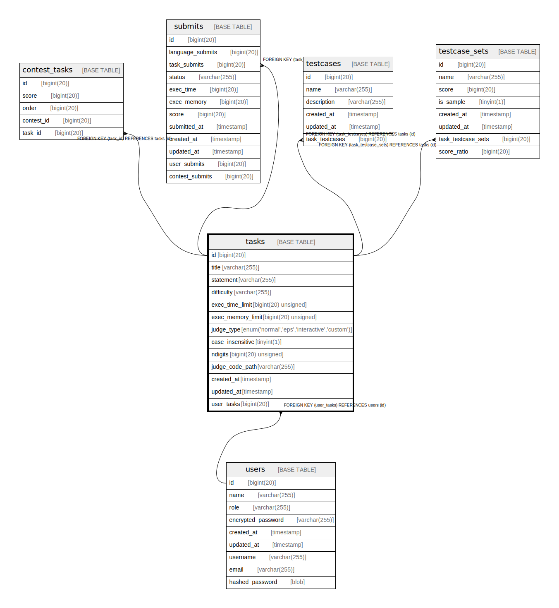

# tasks

## Description

<details>
<summary><strong>Table Definition</strong></summary>

```sql
CREATE TABLE `tasks` (
  `id` bigint(20) NOT NULL AUTO_INCREMENT,
  `title` varchar(255) NOT NULL,
  `statement` varchar(255) NOT NULL,
  `difficulty` varchar(255) NOT NULL,
  `exec_time_limit` bigint(20) unsigned NOT NULL,
  `exec_memory_limit` bigint(20) unsigned NOT NULL,
  `judge_type` enum('normal','eps','interactive','custom') NOT NULL,
  `case_insensitive` tinyint(1) DEFAULT NULL,
  `ndigits` bigint(20) unsigned DEFAULT NULL,
  `judge_code_path` varchar(255) DEFAULT NULL,
  `created_at` timestamp NULL DEFAULT NULL,
  `updated_at` timestamp NULL DEFAULT NULL,
  `user_tasks` bigint(20) DEFAULT NULL,
  PRIMARY KEY (`id`),
  KEY `tasks_users_tasks` (`user_tasks`),
  CONSTRAINT `tasks_users_tasks` FOREIGN KEY (`user_tasks`) REFERENCES `users` (`id`) ON DELETE SET NULL
) ENGINE=InnoDB DEFAULT CHARSET=utf8mb4 COLLATE=utf8mb4_bin
```

</details>

## Columns

| Name | Type | Default | Nullable | Extra Definition | Children | Parents | Comment |
| ---- | ---- | ------- | -------- | ---------------- | -------- | ------- | ------- |
| id | bigint(20) |  | false | auto_increment | [testcases](testcases.md) [testcase_sets](testcase_sets.md) |  |  |
| title | varchar(255) |  | false |  |  |  |  |
| statement | varchar(255) |  | false |  |  |  |  |
| difficulty | varchar(255) |  | false |  |  |  |  |
| exec_time_limit | bigint(20) unsigned |  | false |  |  |  |  |
| exec_memory_limit | bigint(20) unsigned |  | false |  |  |  |  |
| judge_type | enum('normal','eps','interactive','custom') |  | false |  |  |  |  |
| case_insensitive | tinyint(1) | NULL | true |  |  |  |  |
| ndigits | bigint(20) unsigned | NULL | true |  |  |  |  |
| judge_code_path | varchar(255) | NULL | true |  |  |  |  |
| created_at | timestamp | NULL | true |  |  |  |  |
| updated_at | timestamp | NULL | true |  |  |  |  |
| user_tasks | bigint(20) | NULL | true |  |  | [users](users.md) |  |

## Constraints

| Name | Type | Definition |
| ---- | ---- | ---------- |
| PRIMARY | PRIMARY KEY | PRIMARY KEY (id) |
| tasks_users_tasks | FOREIGN KEY | FOREIGN KEY (user_tasks) REFERENCES users (id) |

## Indexes

| Name | Definition |
| ---- | ---------- |
| tasks_users_tasks | KEY tasks_users_tasks (user_tasks) USING BTREE |
| PRIMARY | PRIMARY KEY (id) USING BTREE |

## Relations



---

> Generated by [tbls](https://github.com/k1LoW/tbls)
