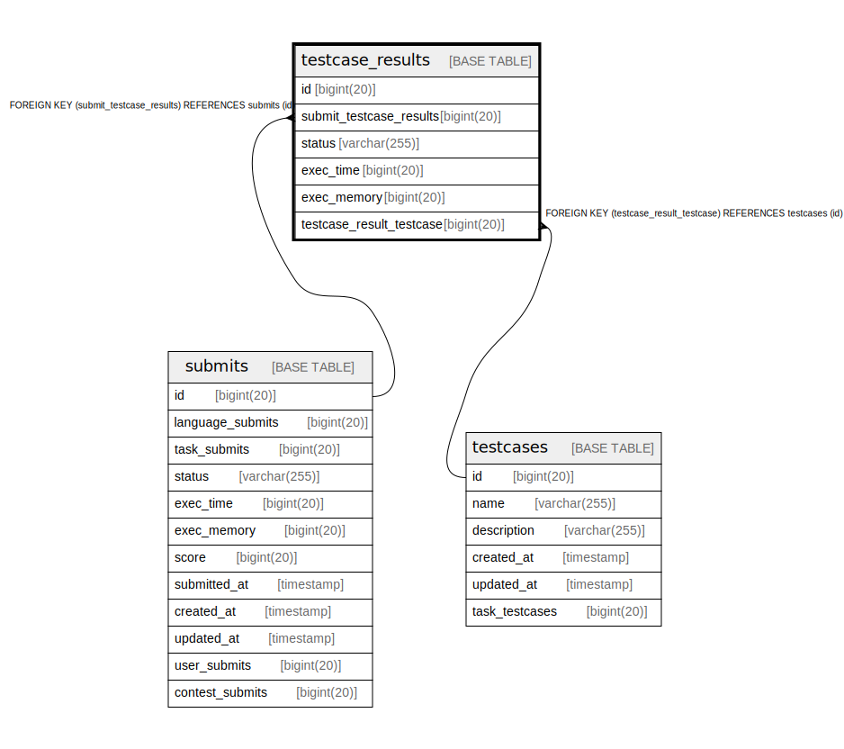

# testcase_results

## Description

<details>
<summary><strong>Table Definition</strong></summary>

```sql
CREATE TABLE `testcase_results` (
  `id` bigint(20) NOT NULL AUTO_INCREMENT,
  `submit_testcase_results` bigint(20) DEFAULT NULL,
  `status` varchar(255) NOT NULL,
  `exec_time` bigint(20) NOT NULL,
  `exec_memory` bigint(20) NOT NULL,
  `testcase_result_testcase` bigint(20) DEFAULT NULL,
  PRIMARY KEY (`id`),
  KEY `testcase_results_submits_testcase_results` (`submit_testcase_results`),
  KEY `testcase_results_testcases_testcase` (`testcase_result_testcase`),
  CONSTRAINT `testcase_results_submits_testcase_results` FOREIGN KEY (`submit_testcase_results`) REFERENCES `submits` (`id`) ON DELETE SET NULL,
  CONSTRAINT `testcase_results_testcases_testcase` FOREIGN KEY (`testcase_result_testcase`) REFERENCES `testcases` (`id`) ON DELETE SET NULL
) ENGINE=InnoDB DEFAULT CHARSET=utf8mb4 COLLATE=utf8mb4_bin
```

</details>

## Columns

| Name | Type | Default | Nullable | Extra Definition | Children | Parents | Comment |
| ---- | ---- | ------- | -------- | ---------------- | -------- | ------- | ------- |
| id | bigint(20) |  | false | auto_increment |  |  |  |
| submit_testcase_results | bigint(20) | NULL | true |  |  | [submits](submits.md) |  |
| status | varchar(255) |  | false |  |  |  |  |
| exec_time | bigint(20) |  | false |  |  |  |  |
| exec_memory | bigint(20) |  | false |  |  |  |  |
| testcase_result_testcase | bigint(20) | NULL | true |  |  | [testcases](testcases.md) |  |

## Constraints

| Name | Type | Definition |
| ---- | ---- | ---------- |
| PRIMARY | PRIMARY KEY | PRIMARY KEY (id) |
| testcase_results_submits_testcase_results | FOREIGN KEY | FOREIGN KEY (submit_testcase_results) REFERENCES submits (id) |
| testcase_results_testcases_testcase | FOREIGN KEY | FOREIGN KEY (testcase_result_testcase) REFERENCES testcases (id) |

## Indexes

| Name | Definition |
| ---- | ---------- |
| testcase_results_submits_testcase_results | KEY testcase_results_submits_testcase_results (submit_testcase_results) USING BTREE |
| testcase_results_testcases_testcase | KEY testcase_results_testcases_testcase (testcase_result_testcase) USING BTREE |
| PRIMARY | PRIMARY KEY (id) USING BTREE |

## Relations



---

> Generated by [tbls](https://github.com/k1LoW/tbls)
