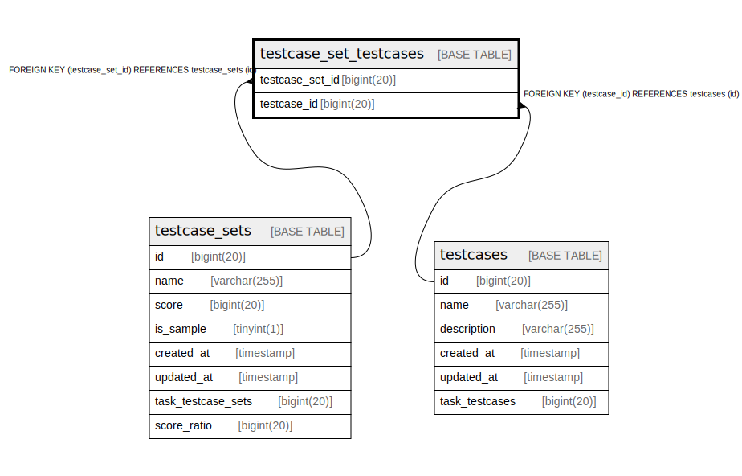

# testcase_set_testcases

## Description

<details>
<summary><strong>Table Definition</strong></summary>

```sql
CREATE TABLE `testcase_set_testcases` (
  `testcase_set_id` bigint(20) NOT NULL,
  `testcase_id` bigint(20) NOT NULL,
  PRIMARY KEY (`testcase_set_id`,`testcase_id`),
  KEY `testcase_set_testcases_testcase_id` (`testcase_id`),
  CONSTRAINT `testcase_set_testcases_testcase_id` FOREIGN KEY (`testcase_id`) REFERENCES `testcases` (`id`) ON DELETE CASCADE,
  CONSTRAINT `testcase_set_testcases_testcase_set_id` FOREIGN KEY (`testcase_set_id`) REFERENCES `testcase_sets` (`id`) ON DELETE CASCADE
) ENGINE=InnoDB DEFAULT CHARSET=utf8mb4 COLLATE=utf8mb4_bin
```

</details>

## Columns

| Name | Type | Default | Nullable | Children | Parents | Comment |
| ---- | ---- | ------- | -------- | -------- | ------- | ------- |
| testcase_set_id | bigint(20) |  | false |  | [testcase_sets](testcase_sets.md) |  |
| testcase_id | bigint(20) |  | false |  | [testcases](testcases.md) |  |

## Constraints

| Name | Type | Definition |
| ---- | ---- | ---------- |
| PRIMARY | PRIMARY KEY | PRIMARY KEY (testcase_set_id, testcase_id) |
| testcase_set_testcases_testcase_id | FOREIGN KEY | FOREIGN KEY (testcase_id) REFERENCES testcases (id) |
| testcase_set_testcases_testcase_set_id | FOREIGN KEY | FOREIGN KEY (testcase_set_id) REFERENCES testcase_sets (id) |

## Indexes

| Name | Definition |
| ---- | ---------- |
| testcase_set_testcases_testcase_id | KEY testcase_set_testcases_testcase_id (testcase_id) USING BTREE |
| PRIMARY | PRIMARY KEY (testcase_set_id, testcase_id) USING BTREE |

## Relations



---

> Generated by [tbls](https://github.com/k1LoW/tbls)
