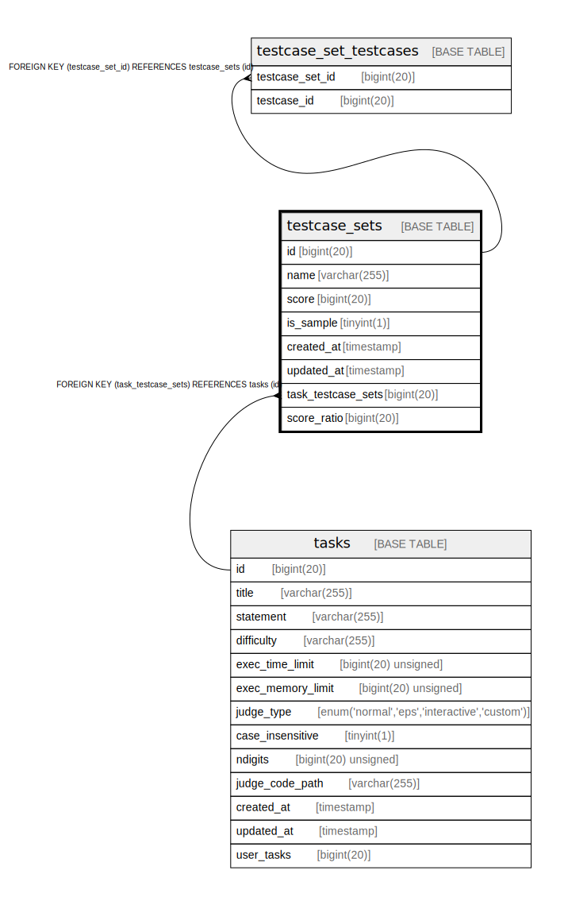

# testcase_sets

## Description

<details>
<summary><strong>Table Definition</strong></summary>

```sql
CREATE TABLE `testcase_sets` (
  `id` bigint(20) NOT NULL AUTO_INCREMENT,
  `name` varchar(255) NOT NULL,
  `score` bigint(20) NOT NULL,
  `is_sample` tinyint(1) NOT NULL,
  `created_at` timestamp NULL DEFAULT NULL,
  `updated_at` timestamp NULL DEFAULT NULL,
  `task_testcase_sets` bigint(20) DEFAULT NULL,
  PRIMARY KEY (`id`),
  UNIQUE KEY `testcaseset_name_task_testcase_sets` (`name`,`task_testcase_sets`),
  KEY `testcase_sets_tasks_testcase_sets` (`task_testcase_sets`),
  CONSTRAINT `testcase_sets_tasks_testcase_sets` FOREIGN KEY (`task_testcase_sets`) REFERENCES `tasks` (`id`) ON DELETE SET NULL
) ENGINE=InnoDB DEFAULT CHARSET=utf8mb4 COLLATE=utf8mb4_bin
```

</details>

## Columns

| Name | Type | Default | Nullable | Extra Definition | Children | Parents | Comment |
| ---- | ---- | ------- | -------- | ---------------- | -------- | ------- | ------- |
| id | bigint(20) |  | false | auto_increment | [testcase_set_testcases](testcase_set_testcases.md) |  |  |
| name | varchar(255) |  | false |  |  |  |  |
| score | bigint(20) |  | false |  |  |  |  |
| is_sample | tinyint(1) |  | false |  |  |  |  |
| created_at | timestamp | NULL | true |  |  |  |  |
| updated_at | timestamp | NULL | true |  |  |  |  |
| task_testcase_sets | bigint(20) | NULL | true |  |  | [tasks](tasks.md) |  |

## Constraints

| Name | Type | Definition |
| ---- | ---- | ---------- |
| PRIMARY | PRIMARY KEY | PRIMARY KEY (id) |
| testcaseset_name_task_testcase_sets | UNIQUE | UNIQUE KEY testcaseset_name_task_testcase_sets (name, task_testcase_sets) |
| testcase_sets_tasks_testcase_sets | FOREIGN KEY | FOREIGN KEY (task_testcase_sets) REFERENCES tasks (id) |

## Indexes

| Name | Definition |
| ---- | ---------- |
| testcase_sets_tasks_testcase_sets | KEY testcase_sets_tasks_testcase_sets (task_testcase_sets) USING BTREE |
| PRIMARY | PRIMARY KEY (id) USING BTREE |
| testcaseset_name_task_testcase_sets | UNIQUE KEY testcaseset_name_task_testcase_sets (name, task_testcase_sets) USING BTREE |

## Relations



---

> Generated by [tbls](https://github.com/k1LoW/tbls)
