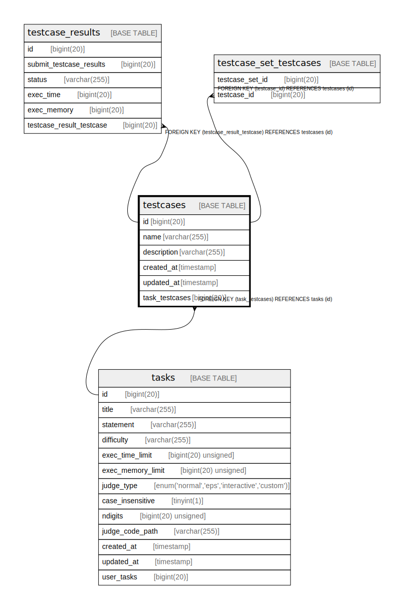

# testcases

## Description

<details>
<summary><strong>Table Definition</strong></summary>

```sql
CREATE TABLE `testcases` (
  `id` bigint(20) NOT NULL AUTO_INCREMENT,
  `name` varchar(255) NOT NULL,
  `description` varchar(255) DEFAULT NULL,
  `created_at` timestamp NULL DEFAULT NULL,
  `updated_at` timestamp NULL DEFAULT NULL,
  `task_testcases` bigint(20) DEFAULT NULL,
  PRIMARY KEY (`id`),
  UNIQUE KEY `testcase_name_task_testcases` (`name`,`task_testcases`),
  KEY `testcases_tasks_testcases` (`task_testcases`),
  CONSTRAINT `testcases_tasks_testcases` FOREIGN KEY (`task_testcases`) REFERENCES `tasks` (`id`) ON DELETE SET NULL
) ENGINE=InnoDB DEFAULT CHARSET=utf8mb4 COLLATE=utf8mb4_bin
```

</details>

## Columns

| Name | Type | Default | Nullable | Extra Definition | Children | Parents | Comment |
| ---- | ---- | ------- | -------- | ---------------- | -------- | ------- | ------- |
| id | bigint(20) |  | false | auto_increment | [testcase_set_testcases](testcase_set_testcases.md) |  |  |
| name | varchar(255) |  | false |  |  |  |  |
| description | varchar(255) | NULL | true |  |  |  |  |
| created_at | timestamp | NULL | true |  |  |  |  |
| updated_at | timestamp | NULL | true |  |  |  |  |
| task_testcases | bigint(20) | NULL | true |  |  | [tasks](tasks.md) |  |

## Constraints

| Name | Type | Definition |
| ---- | ---- | ---------- |
| PRIMARY | PRIMARY KEY | PRIMARY KEY (id) |
| testcases_tasks_testcases | FOREIGN KEY | FOREIGN KEY (task_testcases) REFERENCES tasks (id) |
| testcase_name_task_testcases | UNIQUE | UNIQUE KEY testcase_name_task_testcases (name, task_testcases) |

## Indexes

| Name | Definition |
| ---- | ---------- |
| testcases_tasks_testcases | KEY testcases_tasks_testcases (task_testcases) USING BTREE |
| PRIMARY | PRIMARY KEY (id) USING BTREE |
| testcase_name_task_testcases | UNIQUE KEY testcase_name_task_testcases (name, task_testcases) USING BTREE |

## Relations



---

> Generated by [tbls](https://github.com/k1LoW/tbls)
