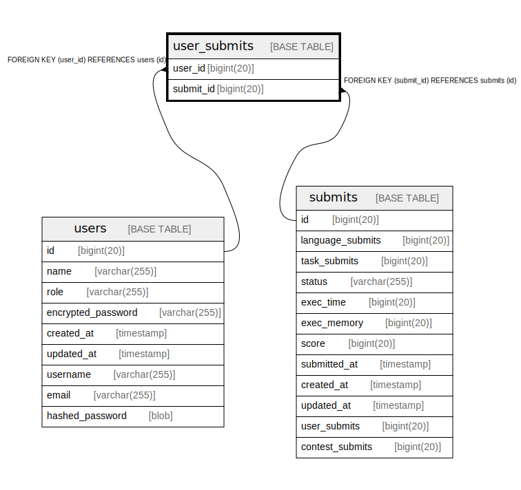

# user_submits

## Description

<details>
<summary><strong>Table Definition</strong></summary>

```sql
CREATE TABLE `user_submits` (
  `user_id` bigint(20) NOT NULL,
  `submit_id` bigint(20) NOT NULL,
  PRIMARY KEY (`user_id`,`submit_id`),
  KEY `user_submits_submit_id` (`submit_id`),
  CONSTRAINT `user_submits_submit_id` FOREIGN KEY (`submit_id`) REFERENCES `submits` (`id`) ON DELETE CASCADE,
  CONSTRAINT `user_submits_user_id` FOREIGN KEY (`user_id`) REFERENCES `users` (`id`) ON DELETE CASCADE
) ENGINE=InnoDB DEFAULT CHARSET=utf8mb4 COLLATE=utf8mb4_bin
```

</details>

## Columns

| Name | Type | Default | Nullable | Children | Parents | Comment |
| ---- | ---- | ------- | -------- | -------- | ------- | ------- |
| user_id | bigint(20) |  | false |  | [users](users.md) |  |
| submit_id | bigint(20) |  | false |  | [submits](submits.md) |  |

## Constraints

| Name | Type | Definition |
| ---- | ---- | ---------- |
| PRIMARY | PRIMARY KEY | PRIMARY KEY (user_id, submit_id) |
| user_submits_submit_id | FOREIGN KEY | FOREIGN KEY (submit_id) REFERENCES submits (id) |
| user_submits_user_id | FOREIGN KEY | FOREIGN KEY (user_id) REFERENCES users (id) |

## Indexes

| Name | Definition |
| ---- | ---------- |
| user_submits_submit_id | KEY user_submits_submit_id (submit_id) USING BTREE |
| PRIMARY | PRIMARY KEY (user_id, submit_id) USING BTREE |

## Relations



---

> Generated by [tbls](https://github.com/k1LoW/tbls)
